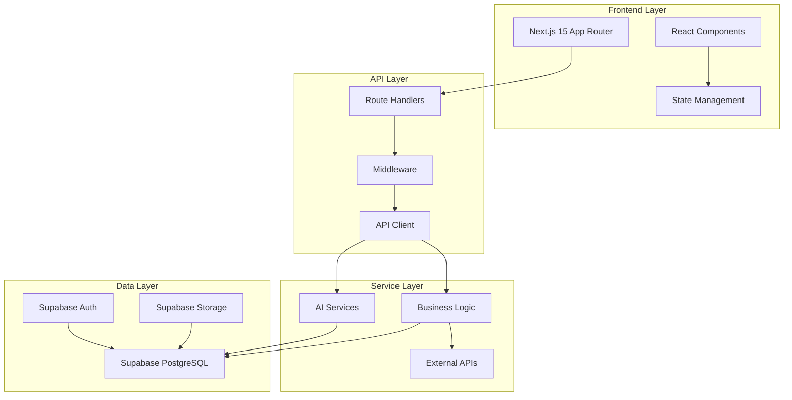
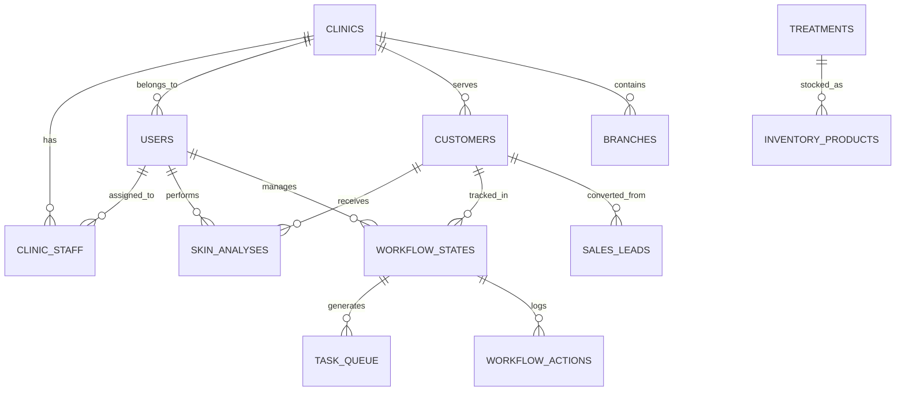

# 🏗️ BN-Aura: Architecture Quick Reference

## System Architecture Overview



## Key Technology Stack

| Layer | Technology | Purpose |
|-------|------------|---------|
| **Frontend** | Next.js 15 | React framework with App Router |
| | TypeScript | Type safety |
| | TailwindCSS | Styling |
| | shadcn/ui | Component library |
| | Framer Motion | Animations |
| | next-intl | Internationalization |
| **State Management** | Zustand | Client state |
| | React Query | Server state |
| **Backend** | Supabase | BaaS platform |
| | PostgreSQL | Database |
| | Row Level Security | Multi-tenancy |
| **AI/ML** | Google Gemini 1.5 | LLM for analysis |
| | MediaPipe | Face detection |
| **Deployment** | Vercel | Hosting platform |

## Database Schema (Core Tables)



## Key Components Location

| Feature | File Location | Description |
|---------|---------------|-------------|
| **Authentication** | `/hooks/useAuth.tsx` | Central auth logic |
| **AI Integration** | `/lib/ai/gemini.ts` | Gemini AI client |
| **API Client** | `/lib/api/client.ts` | Standardized API calls |
| **Dashboard Layout** | `/app/[locale]/(dashboard)/layout.tsx` | Main navigation |
| **Skin Analysis** | `/components/ai/MagicScan.tsx` | AI scanning feature |
| **Sales Workflow** | `/app/[locale]/sales/workflow/page.tsx` | Kanban board |
| **Task Queue** | `/components/beautician/TaskQueue.tsx` | Clinical tasks |

## Environment Variables Priority

### Critical (Must have)
- `NEXT_PUBLIC_SUPABASE_URL`
- `NEXT_PUBLIC_SUPABASE_ANON_KEY`
- `SUPABASE_SERVICE_ROLE_KEY`
- `GOOGLE_AI_API_KEY`

### Important (Should have)
- `NEXT_PUBLIC_APP_URL`
- `RESEND_API_KEY`
- `THAI_SMS_PLUS_API_KEY`
- `NEXTAUTH_SECRET`

### Optional (Nice to have)
- `SENTRY_DSN`
- `GOOGLE_ANALYTICS_ID`
- `STRIPE_SECRET_KEY`

## Common Development Commands

```bash
# Development
npm run dev              # Start dev server
npm run build           # Production build
npm run start           # Start production server

# Testing
npm run test:e2e        # Run E2E tests
npm run test:e2e:ui     # Tests with UI
npm run test:e2e:debug  # Debug mode

# Linting
npm run lint            # Run ESLint
```

## Debugging Tips

1. **Check Network Tab**: Look for API calls to `/api/*` routes
2. **React Query DevTools**: Monitor server state and caching
3. **Supabase Dashboard**: Real-time database inspection
4. **Console Logs**: Check for AI API responses
5. **Local Storage**: Auth tokens and user session

## Security Checklist

- [ ] RLS policies enabled on all tables
- [ ] API routes protected with middleware
- [ ] Environment variables not exposed
- [ ] Input validation on all forms
- [ ] Rate limiting configured
- [ ] CORS properly set

## Performance Optimization Points

1. **Database Queries**
   - Use indexes on foreign keys
   - Optimize JOIN operations
   - Implement pagination

2. **Frontend**
   - Lazy load components
   - Optimize images
   - Use React.memo appropriately

3. **API**
   - Implement caching
   - Use React Query effectively
   - Batch requests when possible

---

**Quick Reference Version**: 1.0  
**Last Updated**: 2 กุมภาพันธ์ 2569
